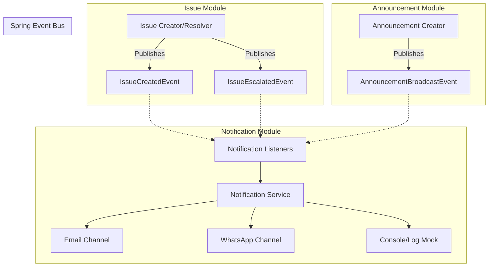

# Issues, Escalations, and Notifications System Design

This document describes the unified design and architecture for the **Issue Management**, **Escalations**, **Announcements (Broadcasts)**, and **Notification** modules within the TenantApp modular monolith.

---

## Implementation Status

> Last Updated: 2026-06-06

| Phase | Description | Backend | Frontend | Status |
| :---- | :---------- | :------ | :------- | :----- |
| **Phase 1** | Notification Infrastructure (Skeleton) | ✅ Done | ➖ Not applicable | **COMPLETE** |
| **Phase 2** | Announcements & Notice Board | ⏳ Pending | ⏳ Pending | **NEXT UP** |
| **Phase 3** | Issues & Comment Timelines | ⏳ Pending | ⏳ Pending | Queued |
| **Phase 4** | Escalations & SLA Engine | ⏳ Pending | ⏳ Pending | Queued |

---

### Phase 1 — Notification Infrastructure ✅ COMPLETE
> Commit: `dd7a439` on `main` branch

**What was built:**
- `com.tenantliving.common.event` — Shared Spring `ApplicationEvent` classes:
  - `IssueCreatedEvent`, `IssueEscalatedEvent`, `AnnouncementBroadcastEvent`
- `com.tenantliving.notification` module — Full infrastructure:
  - `NotificationChannel` enum (`EMAIL`, `WHATSAPP`, `PUSH`, `SMS`)
  - `NotificationStatus` enum (`PENDING`, `SENT`, `FAILED`)
  - `NotificationLogTbl` entity + `NotificationLogRepository` (JPA audit trail)
  - `NotificationChannelSender` — **Strategy interface** (OCP, DIP compliant)
  - `ConsoleNotificationSender` — **Mock dev sender** (prints to console log, no real API calls)
  - `NotificationServiceImpl` — **Orchestrator** (resolves strategy at runtime, persists logs)
  - `NotificationEventListener` — **Async @EventListener** (Observer pattern, decoupled from business modules)
- `V18__create_notification_schema.sql` — Flyway DB migration for `notification_log_tbl`
- `NotificationIntegrationTest` — Integration test verifying event flow and audit log persistence
- `@EnableAsync` added to `TenantLivingApplication`

**Design patterns applied:** Strategy, Observer, SRP, OCP, DIP, LSP

**Secrets needed to switch from mock to real:** See Section 6 below.

---

### Phase 2 — Announcements & Notice Board ⏳ NEXT UP

**Backend to build:**
- Flyway migration for `announcement_tbl` + `announcement_receipt_tbl`
- `com.tenantliving.announcement` module (domain, repository, service, controller)
- REST APIs:
  - `POST /announcements` — Landlord/caretaker creates and broadcasts a notice
  - `GET /announcements` — Tenant fetches notices for their property
  - `POST /announcements/{id}/read` — Tenant marks a notice as read
- Publishes `AnnouncementBroadcastEvent` to trigger notifications

**Frontend to build:**
- Notice Board widget on `TenantHomeScreen` (sticky `CRITICAL` banners + info feed)
- Broadcast Composer modal on `CommandCenterScreen` (scope + severity selectors)
- Auto read-receipt trigger on notice detail open

---

### Phase 3 — Issues & Comment Timelines ⏳ Queued

**Backend to build:**
- Flyway migration for `issue_tbl` + `issue_timeline_tbl`
- `com.tenantliving.issue` module (full CRUD + state machine lifecycle)
- REST APIs for ticket creation, timeline comments, status updates
- Publishes `IssueCreatedEvent` + `IssueEscalatedEvent`

**Frontend to build:**
- Ticket Composer form (category-driven dynamic fields) for Tenants
- Conversational timeline view (speech bubble rendering per action type)
- Landlord Triage Board (grouped by status / escalation level)

---

### Phase 4 — Escalations & SLA Engine ⏳ Queued

**Backend to build:**
- `@Scheduled` cron job scanning for SLA violations (HIGH priority tickets open > 48hrs)
- Manual escalation endpoint + dispute reason capture
- `EscalationStrategy` interface with `SlaAutoEscalationStrategy`, `SafetyEmergencyStrategy`, `FinancialDisputeStrategy` implementations
- Wire real Email (SMTP/Brevo) and WhatsApp (Twilio/Meta) senders into the notification module

**Frontend to build:**
- Escalate button appearing after SLA breach on Tenant ticket view
- Escalation alert banners on Landlord dashboard (red priority indicator)

---

## 1. High-Level Architecture & Decoupling

To prevent tight coupling between business modules (such as `issue` or `announcement`) and communication providers (such as SMTP, Twilio, or Firebase), the system uses an **event-driven design** built on **Spring Application Events**.



### Flow Sequence
1. **Trigger**: An event occurs in a business module (e.g., a tenant escalates a ticket, or a caretaker posts an announcement).
2. **Publish**: The module publishes an application event via `ApplicationEventPublisher`.
3. **Listen**: The `notification` module's `@EventListener` catches the event asynchronously.
4. **Render**: The notification module resolves the correct text or HTML template.
5. **Send**: The message is dispatched through active channels (Email, WhatsApp, or Mock Console logger).

---

## 2. Database Schema

The following tables will be created to support these modules. 

```sql
-- Migration File: V18__create_communication_and_issue_schema.sql

-- ==========================================
-- 1. ISSUE & ESCALATION TABLES
-- ==========================================

CREATE TABLE issue_tbl (
    id VARCHAR(36) PRIMARY KEY,
    property_id VARCHAR(36) NOT NULL,
    unit_id VARCHAR(36), -- NULL if it is a property-wide issue (e.g. elevator, lobby)
    creator_id VARCHAR(36) NOT NULL, -- Tenant or Landlord user ID
    title VARCHAR(255) NOT NULL,
    description TEXT NOT NULL,
    category VARCHAR(50) NOT NULL, -- e.g., PLUMBING, ELECTRICAL, BILLING, NOISE, SAFETY
    priority ENUM('LOW', 'MEDIUM', 'HIGH', 'URGENT') NOT NULL DEFAULT 'MEDIUM',
    status ENUM('OPEN', 'IN_PROGRESS', 'RESOLVED', 'CLOSED') NOT NULL DEFAULT 'OPEN',
    escalation_status ENUM('NONE', 'ESCALATED', 'RESOLVED') NOT NULL DEFAULT 'NONE',
    escalation_level INT NOT NULL DEFAULT 0,
    metadata JSON, -- Dynamic attributes (e.g., model number, leak location)
    created_at DATETIME(6) NOT NULL DEFAULT CURRENT_TIMESTAMP(6),
    updated_at DATETIME(6) NOT NULL DEFAULT CURRENT_TIMESTAMP(6) ON UPDATE CURRENT_TIMESTAMP(6),
    CONSTRAINT fk_issue_property FOREIGN KEY (property_id) REFERENCES property_tbl(id) ON DELETE CASCADE,
    CONSTRAINT fk_issue_unit FOREIGN KEY (unit_id) REFERENCES unit_tbl(id) ON DELETE SET NULL,
    CONSTRAINT fk_issue_creator FOREIGN KEY (creator_id) REFERENCES user_tbl(id) ON DELETE CASCADE
);

CREATE TABLE issue_timeline_tbl (
    id VARCHAR(36) PRIMARY KEY,
    issue_id VARCHAR(36) NOT NULL,
    actor_id VARCHAR(36) NOT NULL, -- User who took the action
    action_type ENUM('CREATE', 'STATUS_CHANGE', 'COMMENT', 'ESCALATE', 'DE_ESCALATE', 'ASSIGN') NOT NULL,
    old_status VARCHAR(50),
    new_status VARCHAR(50),
    comment_text TEXT,
    metadata JSON, -- Dynamic info (e.g. file attachments, assigned contractor details)
    created_at DATETIME(6) NOT NULL DEFAULT CURRENT_TIMESTAMP(6),
    CONSTRAINT fk_timeline_issue FOREIGN KEY (issue_id) REFERENCES issue_tbl(id) ON DELETE CASCADE,
    CONSTRAINT fk_timeline_actor FOREIGN KEY (actor_id) REFERENCES user_tbl(id) ON DELETE CASCADE
);


-- ==========================================
-- 2. ANNOUNCEMENT & BROADCAST TABLES
-- ==========================================

CREATE TABLE announcement_tbl (
    id VARCHAR(36) PRIMARY KEY,
    property_id VARCHAR(36) NOT NULL,
    creator_id VARCHAR(36) NOT NULL, -- Owner, Manager, or Caretaker user ID
    title VARCHAR(255) NOT NULL,
    content TEXT NOT NULL,
    category ENUM('GENERAL', 'MAINTENANCE', 'EMERGENCY', 'BILLING', 'EVENT') NOT NULL DEFAULT 'GENERAL',
    severity ENUM('INFO', 'WARNING', 'CRITICAL') NOT NULL DEFAULT 'INFO',
    target_type ENUM('PROPERTY', 'FLOOR', 'UNIT') NOT NULL DEFAULT 'PROPERTY',
    target_value VARCHAR(100), -- Floor number (e.g., '3') or unit_id depending on target_type
    metadata JSON, -- Custom configs (e.g., links, RSVP parameters)
    created_at DATETIME(6) NOT NULL DEFAULT CURRENT_TIMESTAMP(6),
    updated_at DATETIME(6) NOT NULL DEFAULT CURRENT_TIMESTAMP(6) ON UPDATE CURRENT_TIMESTAMP(6),
    CONSTRAINT fk_announcement_property FOREIGN KEY (property_id) REFERENCES property_tbl(id) ON DELETE CASCADE,
    CONSTRAINT fk_announcement_creator FOREIGN KEY (creator_id) REFERENCES user_tbl(id) ON DELETE CASCADE
);

CREATE TABLE announcement_receipt_tbl (
    id VARCHAR(36) PRIMARY KEY,
    announcement_id VARCHAR(36) NOT NULL,
    user_id VARCHAR(36) NOT NULL, -- Tenant user ID
    read_at DATETIME(6) NOT NULL DEFAULT CURRENT_TIMESTAMP(6),
    CONSTRAINT fk_receipt_announcement FOREIGN KEY (announcement_id) REFERENCES announcement_tbl(id) ON DELETE CASCADE,
    CONSTRAINT fk_receipt_user FOREIGN KEY (user_id) REFERENCES user_tbl(id) ON DELETE CASCADE,
    UNIQUE KEY uq_announcement_user (announcement_id, user_id)
);


-- ==========================================
-- 3. NOTIFICATION LOG TABLE (AUDIT TRAIL)
-- ==========================================

CREATE TABLE notification_log_tbl (
    id VARCHAR(36) PRIMARY KEY,
    recipient_id VARCHAR(36) NOT NULL, -- Target user ID
    channel ENUM('EMAIL', 'WHATSAPP', 'PUSH', 'SMS') NOT NULL,
    recipient_address VARCHAR(255) NOT NULL, -- Email address or phone number
    title VARCHAR(255) NOT NULL,
    body TEXT NOT NULL,
    status ENUM('PENDING', 'SENT', 'FAILED') NOT NULL DEFAULT 'PENDING',
    error_message TEXT,
    created_at DATETIME(6) NOT NULL DEFAULT CURRENT_TIMESTAMP(6),
    CONSTRAINT fk_notification_recipient FOREIGN KEY (recipient_id) REFERENCES user_tbl(id) ON DELETE CASCADE
);

-- Indices
CREATE INDEX idx_issue_property_id ON issue_tbl(property_id);
CREATE INDEX idx_issue_status ON issue_tbl(status);
CREATE INDEX idx_timeline_issue_id ON issue_timeline_tbl(issue_id);
CREATE INDEX idx_announcement_property ON announcement_tbl(property_id);
CREATE INDEX idx_receipt_announcement ON announcement_receipt_tbl(announcement_id);
CREATE INDEX idx_notification_recipient ON notification_log_tbl(recipient_id);
```

---

## 3. Module Breakdown & Responsibilities

### A. The `issue` Module
Responsible for the lifecycle and state transitions of property and unit maintenance/billing disputes.

* **States**:
  * `OPEN`: Ticket created, awaiting review or contractor assignment.
  * `IN_PROGRESS`: A contractor is assigned or scheduling has commenced.
  * `RESOLVED`: Landlord marks the repair as finished.
  * `CLOSED`: Tenant confirms and archives the issue.
* **Escalations**:
  * Can be triggered manually by the Tenant (if the fix was bad or landlord is unresponsive) or the Landlord (if tenant blocks access or building structures require HOA approval).
  * Auto-escalation: Evaluated daily by a background cron job checking for SLA breaches (e.g. `HIGH` priority open tickets with no comments/assignees for >48 hours).
  * State changes transition the record's `escalation_status` to `ESCALATED` and increment `escalation_level`.

### B. The `announcement` Module
Enables caretakers, managers, or landlords to broadcast info.
* **Scoping**: Filters recipient lists by property, floor, or specific unit leases.
* **Auditability**: Tracks read status using `announcement_receipt_tbl`.
* **Urgency Levels**: Banners display as standard feed updates (`INFO`), critical overlays on login (`CRITICAL`), or warnings (`WARNING`).

### C. The `notification` Module
Responsible for rendering template payloads and dispatching messages externally.

* **Service API**: Exposes no business logic endpoints, only listens to event triggers:
  * `IssueCreatedEvent`
  * `IssueStatusChangedEvent`
  * `IssueEscalatedEvent`
  * `AnnouncementBroadcastEvent`
* **Provider Strategy Pattern**:
  * An interface `NotificationChannelSender` specifies the contract.
  * **Email Implementation**: Sends messages via `JavaMailSender` (integrating SendGrid/SES via SMTP).
  * **WhatsApp Implementation**: Utilizes Twilio or Meta's WhatsApp API to dispatch template notifications.
  * **Mock/Console Implementation**: Standard logger configured for local development.

---

## 4. UI Visibility Matrix

| Feature | Tenant Interface | Landlord/Caretaker Interface |
| :--- | :--- | :--- |
| **Issues** | - Create new ticket<br>- Attach photos<br>- View ticket timeline & message landlord<br>- Reopen/Close ticket | - View all property tickets<br>- Assign contractor details<br>- Post timeline updates & invoices<br>- Mark ticket as resolved |
| **Escalations** | - Manual "Escalate" button active after 48hr SLA breach or during dispute | - View escalated tickets in a high-priority dashboard queue |
| **Announcements** | - Chronological Notice Board feed<br>- Sticky alert banners for `CRITICAL` notices<br>- Auto-mark as read on view | - Notice composer (Title, Content, Scope, Urgency)<br>- Detailed read-receipt percentages and tenant audit lists |
| **Notifications** | - Receives Email/WhatsApp alert for new announcements, status changes, and critical updates | - Receives Email/WhatsApp notifications when tickets are escalated or new tickets are raised |

---

## 5. Frontend Architecture & Responsive UI Plan

The frontend will be built inside the React Native / Expo web application (`TenantAppFE`), sharing screens and components across mobile devices and web layouts. It will strictly inherit the existing design tokens defined in [Theme.js](file:///d:/TenantApp/TenantAppFE/src/theme/Theme.js).

### A. Design System & Theme Integration
The components will utilize the following pre-configured tokens to match the existing visual styling:
* **Primary Branding**: `#006875` (Teal primary brand tint) and `#00e5ff` (Cyan secondary container accent).
* **Alert System**: `#ba1a1a` (Error red) for escalated alerts and `#fec931` (Amber/Yellow warning) for critical notices.
* **Containers**: Glassmorphism container cards using Expo's `BlurView` with `intensity={60}` and translucent borders (`rgba(255, 255, 255, 0.8)`).
* **Typography**:
  * Titles: Bold `Manrope` (e.g., `headlineXl` and `headlineLg`).
  * Body Text & Labels: Clean `Inter` (e.g., `bodyMd` and `labelMuted`).
  * Meta-info: `JetBrains Mono` for tags, ticket IDs, timestamps, and SLA counters.

---

### B. Desktop vs. Mobile Layouts (Responsive Design)
We check the viewport size using React Native's `useWindowDimensions()` to dynamically adjust the layout.

```tsx
const { width } = useWindowDimensions();
const isDesktop = width >= 900;
```

#### 1. Desktop Shell (`width >= 900`)
* **Navigation**: Hides the floating bottom navigation bar and displays the persistent frosted-glass **Left Sidebar**.
* **Layout Grid**: 
  * The **Issues Tab** renders a dual-column layout: A list panel of tickets on the left, and a broad conversational timeline and resolution workspace on the right.
  * The **Notice Board Tab** lists recent broadcasts and includes a quick-action overlay to compose a new notice.

#### 2. Mobile Shell (`width < 900`)
* **Navigation**: Uses the floating bottom navigation pill (`BottomNavigation.tsx`) with blur backgrounds.
* **Layout Grid**: Single-column list layouts that push pages onto the router stack (`expo-router`) when selected, maintaining a native app look-and-feel.

---

### C. Specific Screen Specifications

#### 1. Notices & Notice Board (Tenant Home Screen)
Integrates directly into [TenantHomeScreen.tsx](file:///d:/TenantApp/TenantAppFE/src/screens/TenantHomeScreen.tsx):
* **Sticky Critical Banners**: If there is an unread announcement with severity `CRITICAL` (e.g. water shutoff), a glowing red card is pinned to the top of the home screen, dismissing only after acknowledgment.
* **Timeline Feed Widget**: Replaces the static placeholder text under `Rent cycles coming next` with a horizontal carousel or list widget displaying general notices.
* **Read Trigger**: Opening the detail screen of any notice automatically fires the `/read` API tracking call.

#### 2. Issues Screen & Timeline (Tenant & Landlord Portal)
Located at the `/escalations` route ([escalations.tsx](file:///d:/TenantApp/TenantAppFE/app/escalations.tsx)), dynamic based on the active role:
* **Tenant View**:
  * **Ticket Composer Modal**: Allows selection of Category, Title, Priority, and Description. Selecting the "Billing" category automatically pulls context from their unpaid rent cycles.
  * **Interactive Conversation Timeline**: Dispatched comments render as messaging bubbles (green/blue for landlord replies, gray/teal for tenant messages).
  * **Manual Escalation Option**: A red warning button appears alongside details for open tickets. It triggers a pop-up confirmation requiring the tenant to document their escalation reason.
* **Landlord View**:
  * **Triage Board**: Splits tickets into priority lists based on their severity state. Issues with `escalation_status = 'ESCALATED'` are flagged at the top.
  * **Action Hub**: A panel allowing the landlord to select "Assign Contractor" (which prompts for contact name/phone and stores it in the ticket's `metadata` JSON) or "Mark as Resolved" (which pushes a confirmation request to the tenant).

