# 📦 TenantApp — Complete Product Feature Catalog

> **Purpose:** Before mapping features to subscription tiers, we must first identify every distinct capability in the product. This document is the exhaustive audit.

---

## 1. Product Modules Overview

After auditing every controller, service, entity, and screen in the codebase, the entire product breaks down into **7 product modules** containing **24 feature groups**:

```mermaid
graph TD
    PRODUCT["TenantApp Product"]
    
    PRODUCT --> PM["🏢 Property Management"]
    PRODUCT --> FM["💰 Finance & Billing"]
    PRODUCT --> TM["👥 Team & Access"]
    PRODUCT --> CM["📢 Communication"]
    PRODUCT --> AI["🤖 AI Assistant"]
    PRODUCT --> TP["🏠 Tenant Portal"]
    PRODUCT --> RP["📊 Reporting & Analytics"]
    
    PM --> PM1["Properties"]
    PM --> PM2["Units & Floors"]
    PM --> PM3["Floor Editor"]
    PM --> PM4["3D Command Center"]
    PM --> PM5["Maintenance"]
    
    FM --> FM1["Leases"]
    FM --> FM2["Charge Configuration"]
    FM --> FM3["Rent Cycles"]
    FM --> FM4["Meter Readings"]
    FM --> FM5["Expense Sharing"]
    FM --> FM6["Billing Worksheets"]
    FM --> FM7["Financial Ledger"]
    FM --> FM8["Unit Bookings"]
    FM --> FM9["Payments"]
    
    TM --> TM1["Roles & Permissions"]
    TM --> TM2["Team Members"]
    TM --> TM3["Join Codes"]
    
    CM --> CM1["Announcements"]
    CM --> CM2["Notifications"]
    
    AI --> AI1["AI Chat Assistant"]
    
    TP --> TP1["Tenant Home"]
    TP --> TP2["Tenant Payments"]
    TP --> TP3["Tenant Maintenance"]
    
    RP --> RP1["Landlord Dashboard"]
    RP --> RP2["Reports"]
```



---

## 2. Complete Feature Inventory

Every feature is tagged with a **gate type** — how subscriptions control it:

| Gate Type | Symbol | Meaning | Example |
|-----------|--------|---------|---------|
| **Hard Cap** | 🔢 | Numeric limit that differs per plan | Max 3 properties |
| **Boolean** | 🔘 | On/off per plan (included or not) | Premium split: yes/no |
| **Metered** | 📏 | Usage-counted per billing period | 200 AI credits/month |
| **Always Free** | ✅ | Available on all plans, no gating | Login, view own lease |

---

### Module A: Property Management

| # | Feature | Gate Type | What Gets Limited | Source |
|---|---------|-----------|-------------------|--------|
| A1 | Create Property | 🔢 Hard Cap | Max number of properties per account | `PropertyController.createProperty` |
| A2 | Edit / Delete Property | ✅ Always Free | — (allowed if you own it) | `PropertyController.updateProperty/deleteProperty` |
| A3 | Create Units (batch) | 🔢 Hard Cap | Max total units across all properties | `UnitController.generateBatchUnits` |
| A4 | Floor Layout Editor (draw/save) | ✅ Always Free | — (always available for your units) | `UnitController.saveFloorLayout` |
| A5 | 3D Command Center View | 🔘 Boolean | Premium-only interactive building model | `CommandCenterScreen.tsx` |
| A6 | Vacating Units Report | ✅ Always Free | — | `UnitController.getVacatingUnits` |

### Module B: Finance & Billing

| # | Feature | Gate Type | What Gets Limited | Source |
|---|---------|-----------|-------------------|--------|
| B1 | Create Lease | ✅ Always Free | — (bounded by unit count which is already gated) | `LeaseController.create` |
| B2 | Serve Notice / Terminate Lease | ✅ Always Free | — | `LeaseController.serveNotice` |
| B3 | Charge Configuration (CRUD) | ✅ Always Free | — (basic billing setup) | `ChargeConfigController` |
| B4 | Custom Charge Types | 🔘 Boolean | Ability to create custom charge types beyond defaults | `ChargeConfigController` |
| B5 | Generate Rent Cycles (single) | ✅ Always Free | — | `RentCycleController.generate` |
| B6 | Batch Generate Rent Cycles | 🔘 Boolean | Property-wide batch billing generation | `RentCycleController.batchGenerate` |
| B7 | Publish / Unpublish Rent Cycles | ✅ Always Free | — | `RentCycleController.batchPublish` |
| B8 | Pre-flight Billing Checklist | ✅ Always Free | — | `RentCycleController.getPreFlightChecklist` |
| B9 | Meter Readings (record/view) | ✅ Always Free | — (basic utility tracking) | `MeterReadingController` |
| B10 | Billing Worksheet | 🔘 Boolean | Advanced worksheet with charge breakdowns | `BillingWorksheetController` |
| B11 | Financial Ledger | 🔘 Boolean | Full double-entry financial ledger | `LedgerController` |
| B12 | Expense Groups & Splitting | ✅ Always Free | Basic equal-split roommate expenses | `ExpenseGroupController`, `ExpenseSplitController` |
| B13 | Premium Expense Splitting | 🔘 Boolean | Custom ratio / weighted splits | `ExpenseSplitController` |
| B14 | Unit Bookings (create/manage) | ✅ Always Free | — | `UnitBookingController` |
| B15 | Token Payments (online + cash) | ✅ Always Free | — | `UnitBookingController` |
| B16 | Online Rent Payment (Razorpay) | ✅ Always Free | — (tenant-facing) | `PaymentController` |
| B17 | Cash Payment Recording | ✅ Always Free | — | `PaymentController.recordRentCashPayment` |
| B18 | Invoice Generation (PDF) | 🔘 Boolean | Downloadable PDF invoices | `InvoiceController` |

### Module C: Team & Access Control

| # | Feature | Gate Type | What Gets Limited | Source |
|---|---------|-----------|-------------------|--------|
| C1 | Team Members (invite/remove) | 🔢 Hard Cap | Max team members per property | `MembershipController` |
| C2 | Transfer Ownership | ✅ Always Free | — | `MembershipController.transferOwnership` |
| C3 | Join Codes (generate/validate) | ✅ Always Free | — | `PropertyJoinCodeController` |
| C4 | Custom Roles & Permissions | 🔘 Boolean | Ability to create custom roles beyond defaults | `PropertyRoleController.createCustomRole` |
| C5 | Fine-Grained Permission Editing | 🔘 Boolean | Edit individual permissions per role | `PropertyRoleController.updateRolePermissions` |

### Module D: Communication

| # | Feature | Gate Type | What Gets Limited | Source |
|---|---------|-----------|-------------------|--------|
| D1 | Announcements (create/view) | ✅ Always Free | — (basic broadcasts) | `AnnouncementController` |
| D2 | Announcement Read Receipts | ✅ Always Free | — | `AnnouncementController.markAsRead` |
| D3 | In-App Notifications | ✅ Always Free | — | `NotificationLogTbl` |
| D4 | Targeted Announcements (by unit/floor) | 🔘 Boolean | Granular targeting beyond "all tenants" | `AnnouncementTargetType` |

### Module E: AI Assistant

| # | Feature | Gate Type | What Gets Limited | Source |
|---|---------|-----------|-------------------|--------|
| E1 | AI Chat Commands | 📏 Metered | Credits consumed per AI interaction | `ai-service`, `AiCommandValidator` |
| E2 | AI Credit Wallet | ✅ Always Free | Wallet infrastructure (top-up always available) | `BillingWalletService` |
| E3 | AI Lease Analysis | 📏 Metered | Credits consumed per analysis | `ai-service tools` |
| E4 | AI Property Insights | 📏 Metered | Credits consumed per insight | `ai-service tools` |

### Module F: Tenant Portal (TenantAppTenantFE)

| # | Feature | Gate Type | What Gets Limited | Source |
|---|---------|-----------|-------------------|--------|
| F1 | Tenant Home Dashboard | ✅ Always Free | — | `TenantHomeScreen` |
| F2 | View Own Rent Statements | ✅ Always Free | — | `RentCycleController.list` (tenant scoped) |
| F3 | Make Rent Payments | ✅ Always Free | — | `PaymentController` |
| F4 | Submit Maintenance Tickets | ✅ Always Free | — | `MaintenanceTicketController` |
| F5 | View Announcements | ✅ Always Free | — | `AnnouncementController` |
| F6 | Inventory Management | ✅ Always Free | — | `InventoryScreen` |

### Module G: Reporting & Analytics

| # | Feature | Gate Type | What Gets Limited | Source |
|---|---------|-----------|-------------------|--------|
| G1 | Landlord Analytics Dashboard | 🔘 Boolean | Full analytics with trends & breakdowns | `AnalyticsController` |
| G2 | Basic Summary Stats | ✅ Always Free | Simple count-based stats (total units, occupancy %) | `AnalyticsService` (subset) |
| G3 | Advanced Reports (export) | 🔘 Boolean | Exportable reports with date range filters | `ReportsScreen` |

---

## 3. Feature Gate Summary

| Gate Type | Count | Features |
|-----------|-------|----------|
| ✅ Always Free | 24 | Core CRUD, basic billing, tenant portal, payments |
| 🔢 Hard Cap | 3 | Properties, Units, Team Members |
| 🔘 Boolean | 12 | Command Center, Custom Charges, Batch Billing, Worksheets, Ledger, Premium Split, Invoices, Custom Roles, Permissions, Targeted Announcements, Analytics, Reports |
| 📏 Metered | 3 | AI Credits (chat, analysis, insights — all draw from same credit pool) |
| **Total** | **42** | |

> [!NOTE]
> The 24 "Always Free" features are **never gated** — they're the product's baseline value. Only **18 features** (3 hard-cap + 12 boolean + 3 metered) need subscription enforcement.

---

## 4. The `FeatureKey` Enum (Backend)

These are the distinct keys stored in `plan_feature_limit_tbl` and used in the enforcement aspect:

```java
public enum FeatureKey {
    // ── Hard Cap (numeric limits) ──
    MAX_PROPERTIES,            // A1: Max properties per account
    MAX_UNITS,                 // A3: Max total units across all properties
    MAX_TEAM_MEMBERS,          // C1: Max team members per property

    // ── Metered (per-period usage) ──
    AI_CREDITS_MONTHLY,        // E1/E3/E4: Monthly AI credit allocation

    // ── Boolean Toggles (on = included, off = not) ──
    COMMAND_CENTER_3D,         // A5: 3D building model view
    CUSTOM_CHARGE_TYPES,       // B4: Custom charge type creation
    BATCH_RENT_GENERATION,     // B6: Property-wide batch billing
    BILLING_WORKSHEET,         // B10: Advanced billing worksheet
    FINANCIAL_LEDGER,          // B11: Full financial ledger
    PREMIUM_EXPENSE_SPLIT,     // B13: Custom ratio splits
    INVOICE_PDF,               // B18: Downloadable PDF invoices
    CUSTOM_ROLES,              // C4: Custom role creation
    FINE_GRAINED_PERMISSIONS,  // C5: Individual permission editing
    TARGETED_ANNOUNCEMENTS,    // D4: Granular announcement targeting
    ADVANCED_ANALYTICS,        // G1: Full landlord analytics dashboard
    ADVANCED_REPORTS           // G3: Exportable reports
}
```

---

## 5. Tier Allocation Matrix

> Map every gatable feature to the 4 tiers:

### Hard Cap Features

| Feature | STARTER (Free) | BASIC ($9.99/mo) | PREMIUM ($19.99/mo) | ENTERPRISE ($49.99/mo) |
|---------|:-:|:-:|:-:|:-:|
| `MAX_PROPERTIES` | 1 | 3 | 10 | ∞ (-1) |
| `MAX_UNITS` | 5 | 25 | 100 | ∞ (-1) |
| `MAX_TEAM_MEMBERS` | 1 (owner only) | 3 | 10 | ∞ (-1) |

### Metered Features

| Feature | STARTER | BASIC | PREMIUM | ENTERPRISE |
|---------|:-:|:-:|:-:|:-:|
| `AI_CREDITS_MONTHLY` | 50 | 200 | 1,000 | ∞ (-1) |

### Boolean Features

| Feature | STARTER | BASIC | PREMIUM | ENTERPRISE |
|---------|:-:|:-:|:-:|:-:|
| `COMMAND_CENTER_3D` | ❌ | ❌ | ✅ | ✅ |
| `CUSTOM_CHARGE_TYPES` | ❌ | ✅ | ✅ | ✅ |
| `BATCH_RENT_GENERATION` | ❌ | ✅ | ✅ | ✅ |
| `BILLING_WORKSHEET` | ❌ | ❌ | ✅ | ✅ |
| `FINANCIAL_LEDGER` | ❌ | ❌ | ✅ | ✅ |
| `PREMIUM_EXPENSE_SPLIT` | ❌ | ❌ | ✅ | ✅ |
| `INVOICE_PDF` | ❌ | ✅ | ✅ | ✅ |
| `CUSTOM_ROLES` | ❌ | ❌ | ✅ | ✅ |
| `FINE_GRAINED_PERMISSIONS` | ❌ | ❌ | ✅ | ✅ |
| `TARGETED_ANNOUNCEMENTS` | ❌ | ✅ | ✅ | ✅ |
| `ADVANCED_ANALYTICS` | ❌ | ❌ | ✅ | ✅ |
| `ADVANCED_REPORTS` | ❌ | ❌ | ✅ | ✅ |

> [!TIP]
> **Boolean features use `limit_value`:** `1` = enabled, `0` = disabled. This keeps the same table schema for all gate types. The enforcement aspect checks `limit_value > 0` for booleans.

---

## 6. Seed Data SQL

```sql
-- ═══════════════════════════════════════════════════════════
-- STARTER (Free)
-- ═══════════════════════════════════════════════════════════
INSERT INTO plan_feature_limit_tbl (id, plan_id, feature_key, limit_value)
SELECT UUID(), p.id, 'MAX_PROPERTIES', 1 FROM subscription_plan_tbl p WHERE p.plan_key = 'STARTER';
INSERT INTO plan_feature_limit_tbl (id, plan_id, feature_key, limit_value)
SELECT UUID(), p.id, 'MAX_UNITS', 5 FROM subscription_plan_tbl p WHERE p.plan_key = 'STARTER';
INSERT INTO plan_feature_limit_tbl (id, plan_id, feature_key, limit_value)
SELECT UUID(), p.id, 'MAX_TEAM_MEMBERS', 1 FROM subscription_plan_tbl p WHERE p.plan_key = 'STARTER';
INSERT INTO plan_feature_limit_tbl (id, plan_id, feature_key, limit_value)
SELECT UUID(), p.id, 'AI_CREDITS_MONTHLY', 50 FROM subscription_plan_tbl p WHERE p.plan_key = 'STARTER';
-- All booleans = 0 (disabled) for STARTER
INSERT INTO plan_feature_limit_tbl (id, plan_id, feature_key, limit_value)
SELECT UUID(), p.id, f.key_name, 0 FROM subscription_plan_tbl p
CROSS JOIN (
    SELECT 'COMMAND_CENTER_3D' AS key_name UNION ALL
    SELECT 'CUSTOM_CHARGE_TYPES' UNION ALL SELECT 'BATCH_RENT_GENERATION' UNION ALL
    SELECT 'BILLING_WORKSHEET' UNION ALL SELECT 'FINANCIAL_LEDGER' UNION ALL
    SELECT 'PREMIUM_EXPENSE_SPLIT' UNION ALL SELECT 'INVOICE_PDF' UNION ALL
    SELECT 'CUSTOM_ROLES' UNION ALL SELECT 'FINE_GRAINED_PERMISSIONS' UNION ALL
    SELECT 'TARGETED_ANNOUNCEMENTS' UNION ALL SELECT 'ADVANCED_ANALYTICS' UNION ALL
    SELECT 'ADVANCED_REPORTS'
) f WHERE p.plan_key = 'STARTER';

-- ═══════════════════════════════════════════════════════════
-- BASIC ($9.99/mo)
-- ═══════════════════════════════════════════════════════════
-- Hard caps
INSERT INTO plan_feature_limit_tbl (id, plan_id, feature_key, limit_value)
SELECT UUID(), p.id, 'MAX_PROPERTIES', 3 FROM subscription_plan_tbl p WHERE p.plan_key = 'BASIC';
INSERT INTO plan_feature_limit_tbl (id, plan_id, feature_key, limit_value)
SELECT UUID(), p.id, 'MAX_UNITS', 25 FROM subscription_plan_tbl p WHERE p.plan_key = 'BASIC';
INSERT INTO plan_feature_limit_tbl (id, plan_id, feature_key, limit_value)
SELECT UUID(), p.id, 'MAX_TEAM_MEMBERS', 3 FROM subscription_plan_tbl p WHERE p.plan_key = 'BASIC';
INSERT INTO plan_feature_limit_tbl (id, plan_id, feature_key, limit_value)
SELECT UUID(), p.id, 'AI_CREDITS_MONTHLY', 200 FROM subscription_plan_tbl p WHERE p.plan_key = 'BASIC';
-- Booleans enabled for BASIC
INSERT INTO plan_feature_limit_tbl (id, plan_id, feature_key, limit_value)
SELECT UUID(), p.id, f.key_name, 1 FROM subscription_plan_tbl p
CROSS JOIN (
    SELECT 'CUSTOM_CHARGE_TYPES' AS key_name UNION ALL
    SELECT 'BATCH_RENT_GENERATION' UNION ALL SELECT 'INVOICE_PDF' UNION ALL
    SELECT 'TARGETED_ANNOUNCEMENTS'
) f WHERE p.plan_key = 'BASIC';
-- Booleans disabled for BASIC
INSERT INTO plan_feature_limit_tbl (id, plan_id, feature_key, limit_value)
SELECT UUID(), p.id, f.key_name, 0 FROM subscription_plan_tbl p
CROSS JOIN (
    SELECT 'COMMAND_CENTER_3D' AS key_name UNION ALL
    SELECT 'BILLING_WORKSHEET' UNION ALL SELECT 'FINANCIAL_LEDGER' UNION ALL
    SELECT 'PREMIUM_EXPENSE_SPLIT' UNION ALL SELECT 'CUSTOM_ROLES' UNION ALL
    SELECT 'FINE_GRAINED_PERMISSIONS' UNION ALL SELECT 'ADVANCED_ANALYTICS' UNION ALL
    SELECT 'ADVANCED_REPORTS'
) f WHERE p.plan_key = 'BASIC';

-- (PREMIUM and ENTERPRISE follow the same pattern — see tier matrix above)
```

---

## 7. Display Labels for UI PlanCard

These are the `displayLabel` values returned by `GET /api/v1/plans` — derived from the `feature_key` + `limit_value`:

| Feature Key | STARTER label | BASIC label | PREMIUM label | ENTERPRISE label |
|-------------|:---|:---|:---|:---|
| `MAX_PROPERTIES` | "1 Property" | "3 Properties" | "10 Properties" | "Unlimited Properties" |
| `MAX_UNITS` | "5 Units" | "25 Units" | "100 Units" | "Unlimited Units" |
| `MAX_TEAM_MEMBERS` | "Owner Only" | "3 Team Members" | "10 Team Members" | "Unlimited Team" |
| `AI_CREDITS_MONTHLY` | "50 AI Credits/mo" | "200 AI Credits/mo" | "1,000 AI Credits/mo" | "Unlimited AI" |
| `COMMAND_CENTER_3D` | ~~"3D Command Center"~~ | ~~"3D Command Center"~~ | "3D Command Center" | "3D Command Center" |
| `BATCH_RENT_GENERATION` | ~~"Batch Billing"~~ | "Batch Billing" | "Batch Billing" | "Batch Billing" |
| `ADVANCED_ANALYTICS` | ~~"Analytics Dashboard"~~ | ~~"Analytics Dashboard"~~ | "Analytics Dashboard" | "Analytics Dashboard" |
| `INVOICE_PDF` | ~~"PDF Invoices"~~ | "PDF Invoices" | "PDF Invoices" | "PDF Invoices" |
| `PREMIUM_EXPENSE_SPLIT` | ~~"Custom Splits"~~ | ~~"Custom Splits"~~ | "Custom Expense Splits" | "Custom Expense Splits" |
| `CUSTOM_ROLES` | ~~"Custom Roles"~~ | ~~"Custom Roles"~~ | "Custom Roles & Permissions" | "Custom Roles & Permissions" |

> ~~Strikethrough~~ = `included: false` → rendered with ❌ cross icon in the `BulletRow`

---

## 8. What This Means for Implementation

Now that the feature catalog is complete, the implementation path is clear:

1. **`FeatureKey` enum** — 16 entries (Section 4 above) → replaces the old 4-entry `SubscriptionFeature` enum
2. **`plan_feature_limit_tbl` seed data** — 16 rows per plan × 4 plans = **64 rows**
3. **Enforcement annotations** — Add `@EnforceSubscription(feature = FeatureKey.XXX)` to **18 controller methods** (the non-free features)
4. **Validators** — Extend `SubscriptionValidatorRegistry` with validators for each gate type:
   - `HardCapValidator` — queries current count vs. plan limit
   - `BooleanFeatureValidator` — checks `limit_value > 0`
   - `MeteredUsageValidator` — queries `usage_record_tbl` vs. plan limit
5. **Frontend PlanCard** — The `features[]` array in the API response has **~10 display items per plan** (top features shown on the card, not all 16)

---

## 9. Architectural Decision: Why an Enum? (Scalability & The "New Feature" Flow)

You might wonder: *If the UI is fully dynamic and driven by the database, shouldn't the backend feature keys just be Strings in the database so we never have to touch backend code when adding a feature?*

**Short Answer:** No, an Enum is significantly better here because **adding a new feature inherently requires backend code changes anyway.**

### The Reality of Adding a New Gated Feature

Let's say we invent a brand-new feature: **"Automated Lease Renewals"** (a boolean feature). 

Even if the key was a String in the database, we would still have to:
1. **Write the actual code** for the new lease renewal service.
2. **Create the API endpoint** (`POST /api/v1/leases/auto-renew`).
3. **Gate that endpoint** with an annotation.

Because we are already writing code, using an Enum gives us massive advantages over "magic strings":
* **Compile-Time Safety:** We avoid typos like `@EnforceSubscription(feature = "AUTO_RENEWL")`. The code simply won't compile.
* **Discoverability:** You can click the Enum in your IDE and instantly see every endpoint that uses it.
* **Refactoring:** Renaming a feature key across the entire codebase takes one click.

### End-to-End Flow: Adding a New Feature

Here is exactly what the workflow looks like when adding our new "Automated Lease Renewals" feature:

#### Step 1: Update the Backend Enum
Add the new key to `FeatureKey.java`:
```java
public enum FeatureKey {
    // ... existing ...
    AUTOMATED_LEASE_RENEWALS
}
```

#### Step 2: Gate the Code
Add the annotation to the new controller endpoint:
```java
@PostMapping("/auto-renew")
@EnforceSubscription(feature = FeatureKey.AUTOMATED_LEASE_RENEWALS)
public ResponseEntity<?> autoRenew() { ... }
```
*(If it's a Hard-Cap or Metered feature, you also write a tiny `Validator` class that tells the system how to count the current usage, e.g., `countActiveRenewals(userId)`).*

#### Step 3: Insert DB Limits
Run a quick database migration to set the limits for the plans:
```sql
-- Enable for Premium and Enterprise
INSERT INTO plan_feature_limit_tbl (id, plan_id, feature_key, limit_value)
SELECT UUID(), id, 'AUTOMATED_LEASE_RENEWALS', 1 FROM subscription_plan_tbl WHERE plan_key IN ('PREMIUM', 'ENTERPRISE');

-- Disable for Starter and Basic
INSERT INTO plan_feature_limit_tbl (id, plan_id, feature_key, limit_value)
SELECT UUID(), id, 'AUTOMATED_LEASE_RENEWALS', 0 FROM subscription_plan_tbl WHERE plan_key IN ('STARTER', 'BASIC');
```

#### Step 4: The Frontend (Zero Code Changes!)
The next time a user visits the pricing page, the API automatically includes `AUTOMATED_LEASE_RENEWALS` in the feature list. The `<PlanCard>` component loops through the features and automatically renders the new bullet point.

**Summary:** The database drives the data and the UI presentation, but the Enum strongly types the access control in the backend. This is the perfect balance of dynamic rendering and robust, type-safe security.
